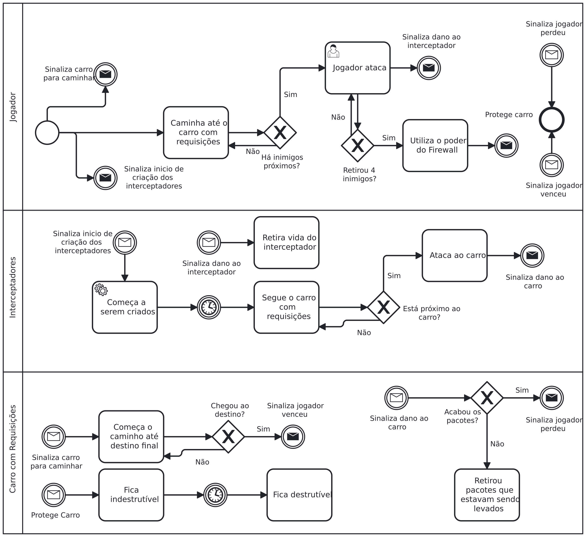
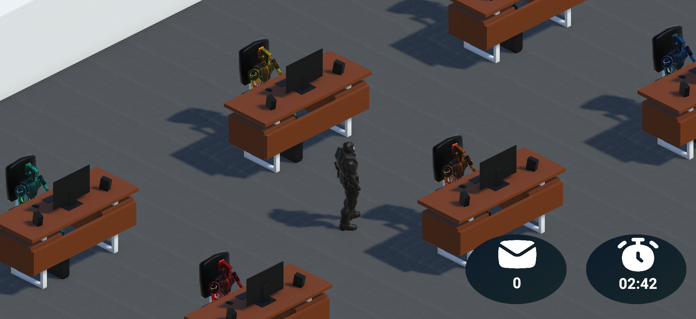
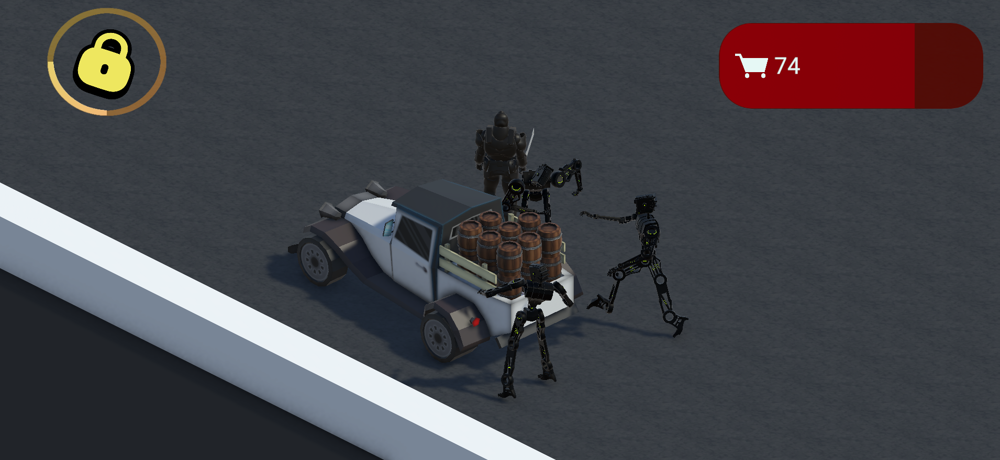
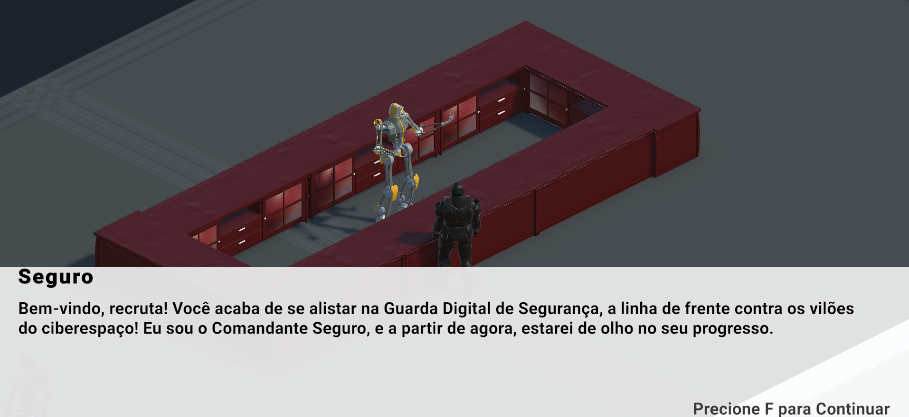

# Especificação do Trabalho de Conclusão de Curso

Pré-requisitos: <a href="2-TrabalhosRelacionados.md"> Trabalhos Relacionados</a>

# Desenvolvimento do CyberWar: Jogo de Cibersegurança Interativo

O desenvolvimento do **CyberWar** surgiu da necessidade de ensinar cibersegurança de forma acessível e envolvente. Para isso, foi criada uma experiência interativa que permite aos jogadores aprenderem na prática como proteger informações digitais.

## Metodologia de Desenvolvimento

O projeto foi guiado pela metodologia **Scrum**, escolhida por sua capacidade de organizar o fluxo de trabalho de forma ágil e interativa. As atividades foram divididas em **Sprints**, o que possibilitou acompanhar o progresso em ciclos curtos e facilitou a adaptação contínua às necessidades do projeto. Esse modelo colaborativo integrou diferentes áreas, como design, programação, narrativa e pesquisa, promovendo uma visão clara e integrada de todas as etapas do desenvolvimento.

## História do Jogo

O jogo se passa na **Guarda Digital de Segurança**, uma agência responsável por defender sistemas contra ameaças cibernéticas. O jogador assume o papel de um novato recém-contratado, que precisa aprender a lidar com ataques virtuais e impedir que criminosos comprometam dados sensíveis.

### NPCs e Ambientação

Para tornar a jornada mais dinâmica, foram criados **NPCs** (Personagens Não Jogáveis) que ajudam a contar a história, fornecendo orientações e contextualizando os desafios de maneira lúdica. Além disso, foram selecionados **efeitos sonoros**, **animações**, **texturas** e **materiais** através do Mixamo e da Unity Asset Store, que permitem o uso desses recursos para jogos não lucrativos.

## Pesquisa e Definição de Ameaças

A escolha dos ataques abordados no jogo foi fundamentada em pesquisas sobre as principais ameaças digitais da atualidade. Dados recentes apontam que **phishing** e **Man-In-The-Middle (MitM)** estão entre as técnicas mais utilizadas por hackers.

- O phishing está presente em **79%** dos ataques de tomada de conta (ATO) e é considerado a maior ameaça cibernética para **30%** das pequenas empresas (SOCRadar, 2024).
- Os ataques MitM representam **19%** dos ataques online bem-sucedidos e são responsáveis por **35%** das explorações de redes Wi-Fi inseguras (Security Escape, 2024).

Esses dados evidenciam a importância de ensinar os usuários a identificar e mitigar essas ameaças, baseando o desenvolvimento dos minigames nessas informações.

## Minigames

### Minigame de Man-In-The-Middle

Neste minigame, o jogador deve proteger o **Carro-Pacote**, que transporta informações sigilosas, contra o **Interceptador Fatal**, um inimigo que tenta roubar os dados no caminho. O jogador conta com dois recursos para impedir o ataque:
- **Espada** (representando a criptografia), que bloqueia o inimigo.
- **Firewall temporário**, que torna o carro invulnerável por um curto período.

O desafio é usar esses recursos estrategicamente para proteger as informações, simulando na prática como as medidas de proteção funcionam na segurança digital.

### Minigame de Phishing

O jogador deve analisar e-mails suspeitos recebidos por NPCs e identificar sinais de fraude. Para isso, ele precisa verificar quatro aspectos fundamentais:
1. Se o remetente é confiável.
2. Se há erros de português.
3. Se o e-mail contém links suspeitos.
4. Se usa táticas de pressão psicológica.

Caso o jogador identifique corretamente um e-mail falso, ele acumula pontos e reforça seu aprendizado sobre como evitar esse tipo de golpe no mundo real.

## Tecnologias Utilizadas

- **Unity**: Escolhida como motor gráfico devido à sua flexibilidade, compatibilidade com múltiplas plataformas e alto desempenho.
- **C#**: Linguagem de programação utilizada para criar simulações realistas dos ataques cibernéticos e implementar as mecânicas do jogo.

## Desenvolvimento e Testes

O jogo foi desenvolvido em 3D com uma câmera isométrica para oferecer uma experiência imersiva. Foram criados cenários detalhados, animações para os NPCs e efeitos sonoros que aumentam a sensação de realismo. Cada elemento foi pensado para tornar o aprendizado mais fluido e acessível.

Diversas sessões de testes foram realizadas para ajustar e equilibrar as mecânicas do jogo, assegurando uma experiência justa, acessível e divertida para todos os jogadores.

## Conclusão

O **CyberWar** é um projeto que visa ensinar cibersegurança de forma interativa e educativa, utilizando minigames que abordam as ameaças mais comuns na internet. A experiência é projetada para ser divertida, educativa e fácil de entender, oferecendo aos jogadores as ferramentas para se protegerem no mundo digital.

  

    <strong>Diagrama ilustrativo sobre o minigame Man In The Middle</strong>
  

  

  

    <strong>Diagrama ilustrativo sobre o minigame Phishing</strong>
  

  

  

    <strong>Imagem ilustrativa do minigame Phishing</strong>
  

  

  

    <strong>Imagem ilustrativa do minigame Man In The Middle</strong>
  

  

  

    <strong>Hub com NPC que explica sobre conceitos de cibersegurança</strong>
  

  

